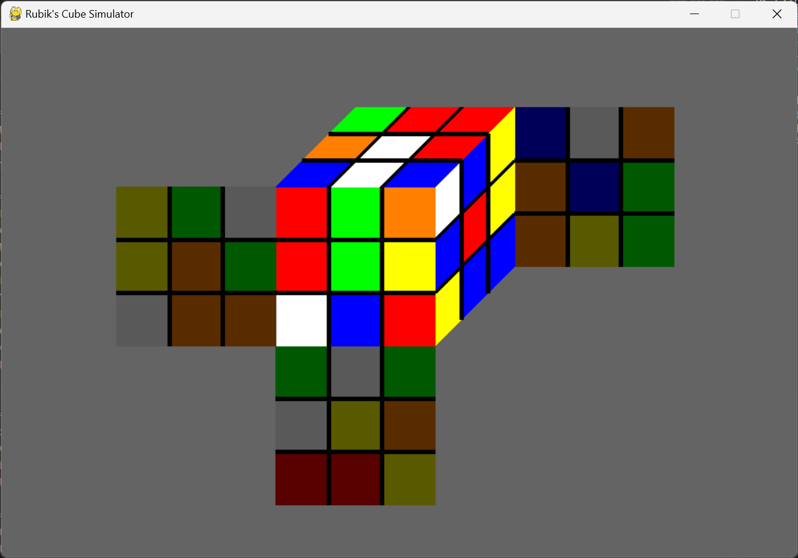

# Virtual-Rubiks-Cube

Virtual machine for Rubik's cube with pygame

Inspired by [csTimer](https://cstimer.net)

## Execute
`python3 game.py`

## Command
|move|key|move|key|
|----|---|----|---|
|U|`j`|U'|`f`|
|F|`h`|F'|`g`|
|R|`i`|R'|`k`|
|D|`s`|D'|`l`|
|B|`w`|B'|`o`|
|L|`d`|L'|`e`|
|u|`,`|u'|`c`|
|f|None|f'|None|
|r|`u`|r'|`m`|
|d|`z`|d'|`/`|
|b|None|b'|None|
|l|`v`|l'|`r`|
|M|`5`, `6`|M'|`x`, `.`|
|E|None|E'|None|
|S|None|S'|None|
|x|`t`, `y`|x'|`b`, `n`|
|y|`,`|y'|`a`|
|z|`p`|z'|`q`|
|Reset|`F5`|Shuffle|`F4`|

## Sight
You can modify the variable `FULL_SIGHT` by yourself.

`True` to see all faces 
`False` to see only U, R, F faces

## TODO
- modify is_solved function
